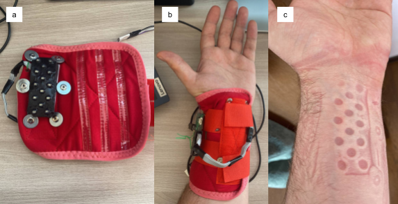
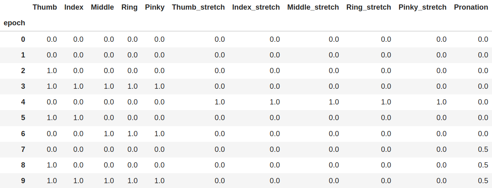
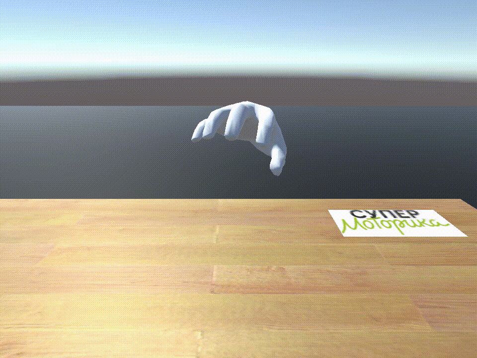
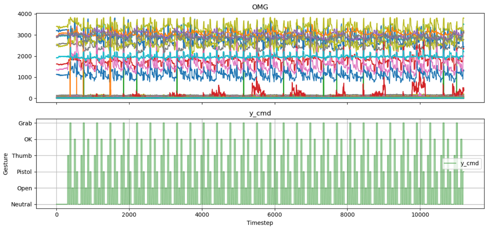
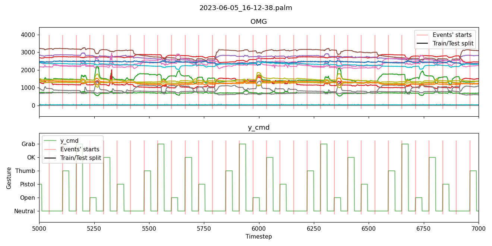

# Work with OMG sensors data (Time series classification)

Данная работа основана на задаче, которой я и мои коллеги занимались во время стажировки (учебной практики) в компании [Моторика](https://motorica.org/).

## Часть 1. Обзор задачи распознавания жестов

### Легенда

Команда Моторики стремится к тому, чтобы 100% людей без рук ежедневно пользовались доступными функциональными протезами с высоким уровнем сервиса, делая свою жизнь удобнее, ярче и счастливее. Компания «Моторика» исследует и разрабатывает технологии на стыке медицины и робототехники с 2014 года. На данный момент компания выпускает два типа протезов: активные тяговые протезы Киби и бионические протезы Инди и Манифесто. Протезы подходят для детей и взрослых с ампутациями верхних конечностей на уровне кисти и предплечья. Также компания решает различные R&D задачи, в том числе те, что находятся на стыке машинного обучения и человеко-машинных интерфейсов. На пересечении данных областей могут быть найдены или открыты совершенно новые подходы к управлению протезами.

В ходе стажировки компания Моторика совместно со Skillfactory предложила участникам попробовать свои силы в решении задач машинного обучения в области протезирования.

### Сбор данных

#### Сетап

Назовем *Пилотом* человека, с которого производится сбор данных. На руку пилота надета оптомиографическая манжета (дальше будем именовать ее как ОМГ-манжета), главным элементом которой являются оптомиографические датчики.

* (a) ОМГ-манжета вид с внутренней стороны, где располагаются датчики;
* (b) ОМГ-манжета установленная на руку пилота перед процедурой сбора данных;
* (с) место контакта датчиков ОМГ-манжеты с рукой пилота.

В ходе процедуры сбора данных ОМГ-манжета с определенной частотой фиксирует, полученные от ОМГ-датчиков значения.

#### Протокол сбора данных

Чтобы унифицировать процедуру сбора данных собирается некоторый *Протокол*. Протокол — это последовательность жестов, которые выполняет пилот во время процедуры сбора данных.

Tабличное представление протокола (первые 10 строк):

Столбец 'epoch' обозначает номер выполняющегося жеста, может быть использован для дальнейшего сопоставления с ОМГ-данными (по столбцу 'SYNC').

Каждая строчка протокола содержит в себе команды, которую должен выполнить пилот. Первые 5 столбцов [Thumb, …, Pinky] обозначают сгибаются ли соответствующие пальцы, а вторые 5 столбцов [Thumb_stretch, …, Pinky_stretch] — вытягиваются ли соответствующие пальцы.

Разберем жесты закодированные в протоколе:

* Neutral/NOGO (все нули) - нейтральное положение кисти, кисть в расслабленном состоянии;
* Thumb (Thumb равен 1) - сгиб большого пальца;
* Grab (Thumb, Index, Middle, Ring, Pinky равны 1) - сват, кисть сжата в кулак;
* Open (Thumb_stretch, Index_stretch, Middle_stretch, Ring_stretch, Pinky_stretch равны 1) - открытая ладонь, пальцы выпрямлены;
* OK (Thumb, Index равны 1) - жест "Окей";
* Pistol (Middle, Ring, Pinky равны 1) - жест "Пистолет".

Протокол цикличен, есть некоторая подпоследовательность жестов, которая повторяется.

На текущем шаге у нас представлено необходимое оборудование для сбора данных, заданная последовательность жестов к выполнению пилотом. После этого и выполняется сбор данных. Но чтобы облегчить задачу пилота, протокол для сбора данных осуществлялся в парадигме Motion Match.

#### Motion Match

Относительно специфики задачи motion match используется следующим образом:

* кто-то/что-то отдает команду пилоту на выполнение жеста;
* пилот выполняет движение, согласно отданной команде.

В нашем конкретном случае используется виртуальная рука, которая выполняет жесты согласно заданному ранее протоколу. Пилот повторяет жесты за виртуальной рукой с некоторой естественной задержкой. Такой подход сбора данных позволяет пилоту больше сконцентрироваться на воспроизведении жестов.

Примерно такое изображение и наблюдают пилоты на экране.

В текущей парадигме переход между жестами выполняется через нейтральное состояние:

`… -> Neutral -> Gesture1 -> Neutral -> Gesture2 -> Neutral -> …`

#### Пример собранных данных

Верхний график отображает данные, полученные от ОМГ-датчиков. Ось X является осью времени, а ось Y отображает значения датчиков. Нижний график отображает протокол выполнения жестов, которому следовал пилот в ходе сбора данных.

Здесь верхний график отображает ОМГ-данные в приближенном масштабе. Ось X является осью времени, а ось Y отображает значения датчиков. Нижний график отображает протокол выполнения жестов, которому следовал пилот в ходе сбора данных.

Нужно иметь в виду, что каждому моменту времени соответствует конкретный жест.

### Постановка задачи

Основная задача стажировки заключается в том, чтобы построить модель, которая на основе ОМГ-данных распознавала бы, какой жест выполняется в данный момент. В терминах машинного обучения задача сводится к многоклассовой классификации.

Участникам стажировки были предоставлены наборы данных (данные + протокол) от здоровых и целевых пилотов.

Также очень важно учесть особое требование к решению задачи: скорость инференса алгоритма должна быть меньше 33 мс на ПК.

#### Репозиторий

[Ссылка](https://github.com/MaxBalashov/motorica-x-skillfactory-gestures/tree/main) на репозиторий с кодом бейзлайна и описанием задачи.

Также была предоставлена [ссылка на ноутбук](https://github.com/sin-mike/2022_neurotech_course/blob/master/4%20-%20mnist_arduino_example/mnist_arduino_example.ipynb) одного из специалистов Моторики, в котором с помощью MNIST-датасета происходит некоторая симуляция работы с данными типа временных рядов.

#### Валидация решений

*Тестовая выборка*. В представленных данных есть разделение на обучающую и тестовую выборки. Тестовая выборка является открытой для участников стажировки, на ней можно в оффлайне проверять качество разработанных моделей.

*Онлайн тест*. Тестирование с помощью ОМГ-манжеты один из способов проверить разработанные модели в условиях приближенных к целевым. Шаблон инференса модели в режиме реального времени представлен в [ноутбуке](https://github.com/MaxBalashov/motorica-x-skillfactory-gestures/blob/main/baseline_logreg.ipynb) в главе “Real-time inference”.

Организаторы стажировки предлагают подставить разработанную модель (а возможно еще и постпроцессинг выхода модели) в данный шаблон. Ноутбук с обучением модели, валидацией на тестовой выборке и инференсом модели в реальном времени на протезе передается Моторике. Сотрудники Моторики проводят валидацию решения стажера на пилоте.

### Проблемы*

Т.е. задачи со звездочкой.

#### Задача генерализации монтажей для одного пилота

Монтаж — конкретная установка ОМГ-манжеты на руку пилота. В текущих условиях нельзя дважды установить ОМГ-мажету идентичным образом, поэтому монтажи различаются между собой. Это различие отображается в собранных данных от монтажа к монтажу. Таким образом обученная система принятия решений (СПР) на собранных заранее данных, может быть не готова для работы с данными полученными в ходе установки нового монтажа.

Для продуктового решения необходимо минимизировать время донастройки СПР, так чтобы пилоту не приходилось проходить полный цикл сбора данных в текущем монтаже с последующим полным обучением СПР под этот конкретный монтаж.

#### Задача генерализации монтажей для нескольких пилотов

Это обобщение проблемы выше, но для некоторого числа пилотов, по каждому из которых есть один или более монтажей. Неформальная постановка задачи: "Возможно ли обучить модель на данных некоторого числа пилотов (чем больше тем лучше), которая после обучения будет достаточно хорошо работать на новых данных тех же пилотов." + можно добавить возможность короткой донастройки СПР с использованием данных текущего монтажа.

#### Задача портирования решения на МК

Чтобы разрабатываемые решения были приближены к продуктовым требованиям, стоит учесть, что вычисления необходимые для СПР будут производиться на микроконтроллере. Поэтому решение должно быть потенциально портируемо на микроконтроллер.

Это не означает, что разрешено пользоваться только легкими моделями (деревья решений, логистическая регрессия и тп). Можно использовать и нейронные сети, но есть ограничение на количество операций с плавающей точкой (FLOPS). Например, слои Conv2D имеют слишком большие FLOPS — их вычисление на МК будет занимать много времени. Но даже при таких архитектурах можно воспользоваться различными подходами, например, дистилляцией моделей.

## Часть 2. Решение задачи распознавания жестов

В этой части мы кратко рассмотрим проделанную работу. Но сперва составим содержание репозитория, учитывая порядок подготовки ноутбуков.

### Содержание

0. Baseline-решения (папка `baseline notebooks`)
1. Решение тестовой задачи (`solving_the_test_task`)
2. Отчет по запуску моделей и исследование данных (`runs_report`)
3. Создание генеральных моделей (`general_models`)
4. Работа с новыми данными (`work_with_three_sets`)

#### Baseline

Тетрадки с baseline-решениями (для старых и новых данных) предоставлены Моторикой и с некоторой минимальной редакцией были включены в репозиторий в отдельной папке.

Основой базового решения в обоих случаях выступает логистическая регрессия. Качество реализованных подходов можно оценить по визуализациям предсказаний моделей на инференсе:

Здесь представлена работа с одним из датасетов из старого набора. Предсказания несколько отстают от таргета + некоторые классы жестов остаются нераспознанными.

Работа с новыми данными. Ситуация чуть получше, но также присутствует лаг реакции модели.

Средневзвешенная по всем классам жестов метрика F1 в обоих случаях колеблется в районе 0,66-0,67.

#### Решение тестовой задачи

Перед началом стажировки (учебной практики) организаторами было предложено опробовать себя в решении [тестового задания на Kaggle](https://www.kaggle.com/competitions/motorica-skillfactory-internship-test-task-2023-12). Этому заданию я успел посвятить [другой свой проект](https://github.com/khav-i/ml_works_tau/blob/master/Classification%20of%20OMG-sensors%20signals/README.md), который в свою очередь можно воспринимать в качестве baseline-решения того решения тестового задания, что представлено уже здесь. В добавок я также [пытался решить задачу с помощью нейросетей](https://github.com/khav-i/nn_works/blob/master/Motorica%20SkillFactory%20internship%20test%20task%202023-12/motorika_tf.ipynb) — первый подобный опыт для меня. Но работы в настоящем репозитории опираются на классические методы машинного обучения.

В ноутбуке `solving_the_test_task` реализован подход к решению, который оформился в ходе учебной практики. Собственно, оно и представляет собой простое *перерешение* задачи, т.к. оформлено уже после стажировки. Новые методы: устранение лага между данными и таргетом для обеспечения более адекватного обучения моделей; использование методов линейной аппроксимации данных как способ создания признакового описания — метод которым я обязан своей удачной находке [статьи ученых из МФТИ](https://www.mathnet.ru/php/archive.phtml?wshow=paper&jrnid=ia&paperid=452&option_lang=rus); а также метод грубого перебора комбинаций данные-модель, в котором на предобработанных разными способами данных последовательно обучается зоопарк алгоритмов. Те же самые методы с некоторыми изменениям реализованы, разумеется, также в остальных тетрадках.

Лучшее решение продемонстрировал алгоритм CatBoost, обученный на комбинации нормализованных данных с коэффициентами аппроксимирующих моделей. Визуализация предсказаний валидационной выборки:

Метрики тестовой выборки (сабмит на Kaggle):

Как видим, относительно простые методы помогают добиться приемлемых результатов. [nbviewer версия ноутбука](https://nbviewer.org/github/khav-i/Work-with-OMG-sensors-data/blob/master/solving_the_test_task.ipynb).

#### Отчет по запуску моделей и исследование данных

Тетрадка `runs_report` начинается с обзора отчетов по прогону 31 сета данных через 20 алгоритмов: таким образом возможно предварительно установить наиболее проблемные сеты — они обычно плохо поддаются моделированию на всех алгоритмах. Проблемными оказались данные первого пилота (всего их 4).

Далее проводилось исследование гомогенности выборок: обучалась модель для классификации строк данных по принадлежности к выборке. Оказалось, что они часто действительно сильно отличаются: в 15 сетах модель хорошо различала среди перемешанных строк те, что относятся к треннировочной выборке; в остальных 16 она одинаково хорошо распознавала строки обеих выборок. И это обстоятельство может служить косвенным свидетельством будущих проблем с обобщающей способностью моделей: если данные в выборках и правда отличаются, то будучи обученной на треннировочной выборке модель рискует оказаться неадекватой для тестовой.

Причина отличия может состоять в том, что пилоты просто устают выполнять команды и теряют концентрацию, либо также в том, что в процессе выполнения пилотом жестов датчики на манжете постепенно меняют место расположения на коже.

Возможным решением такой проблемы может стать смена индекса отсечения треннировочной выборки от тестовой: можно взять тестовую выборку из начала таблицы. Однако этот способ опробован не был: мы придерживались указаний Моторики по сэмплированию: в метаданных для сетов были зафиксированы последние индексы трейн-сетов.

Третий раздел ноутбука был посвящен визульному анализу данных путем их отображения в пространстве меньшей размерности. Этот раздел вышел наиболее интересным, т.к. он позволил с некоторой степенью обозначить причину проблем, сопровождающих процесс подготовки генеральных моделей для таких данных.

[nbviewer версия ноутбука](https://nbviewer.org/github/khav-i/Work-with-OMG-sensors-data/blob/master/runs_report.ipynb).

#### Создание генеральных моделей

В тетрадке `general_models` продолжается работа с отчетами по моделям, обученным для каждого сета. На этот раз мы занимаемся задачей создания общих моделей для каждого пилота и генеральной модели для всех пилотов сразу (или проверяем возможность создания таковых).

Решить проблему в лоб, обучив модели на объединенном массиве сетов, не получилось еще в ходе учебной практики: такие модели обладают, увы, плохой предсказательной силой (возможная причина такой ситуации обсуждается в `runs_report`). Следовательно, необходимо произвести сперва некоторый отбор. Первое очевидное решение — произвести грубый перебор всех комбинаций данных, однако их число, например, для второго пилота довольно большое — 1 048 555 (для 19 сетов).

И здесь мы снова беремся за отчеты по запускам, отбирая среди сетов те, на которых были обученны модели, выдающие приемлемые метрики. Тем самым мы существенно уменьшаем число перебираемых комбинаций. Далее мы запускаем алгоритм итеративного поиска удачных комбинаций сетов, считаем метрику и устанавливаем оптимальные наборы для обучения генеральных моделей. Также проводим дополнительные тесты с простыми (нормализация и сглаживание) методами предобработки. А еще пробуем предсказать классы жестов на сетах, не вошедших в пул трейн-сета:

Здесь индексы соответствуют номеру пилота (по одному сету). Мы видим существенную разницу в метриках: данные четвертого пилота представлены всего одним сетом, поэтому мы не располагаем другим, проверочным; а на данных остальных пилотов видим последствия неадекватности генеральной модели. Причина такой аномалии, смею надеяться, как минимум косвенно уже обозначено в `runs_report`: данные для одних и тех же пилотов часто имеют довольно несхожие характеристики — даже при исполнении тех же самых жестов. 

Разумеется, та же проблема возникает и с моделями, обученными для каждого из пилотов. Т.к. данные бывают совсем непохожими, модель не узнает из тех, что видит, что-то, что могло бы обогатить ее представления о характере выполнения жестов пилота, раскрывающемся нескоклько иным образом в сетах, которые она не видела. Поэтому к результатам генеральных моделей стоит относиться скептически.

Результаты оффлайн-инференса:

Генеральная модель (gm) обучалась на четырех сетах, принадлежащих разным пилотам.

Так мы и установили, что создание генеральных моделей возможно, но это сомнительное предприятие: такие модели обучены *видеть* не жесты как таковые, но отличать комбинации жест-пилот. [nbviewer версия ноутбука](https://nbviewer.org/github/khav-i/Work-with-OMG-sensors-data/blob/master/general_models.ipynb).

#### Работа с новыми данными
